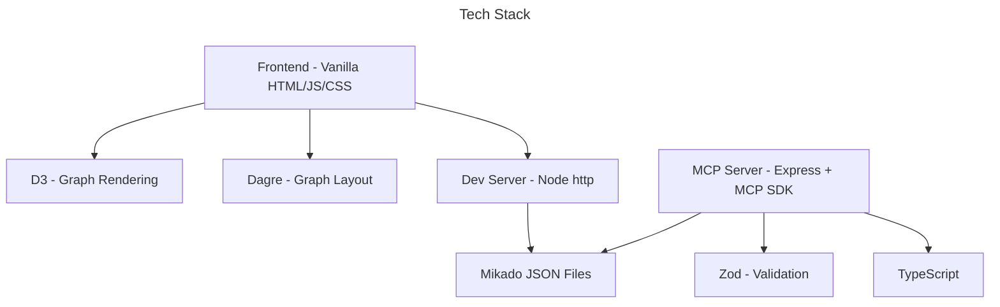
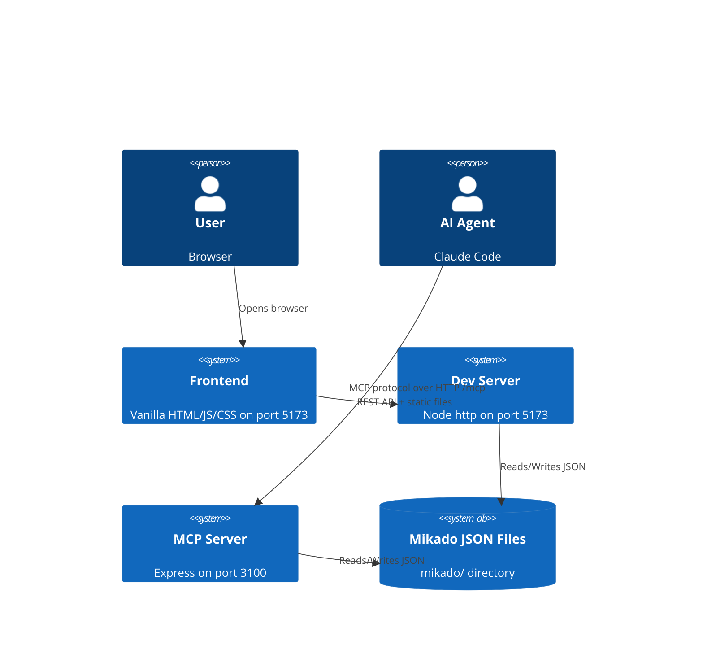

# Architecture

## Language/Framework

- Frontend: Vanilla HTML/CSS/JS, D3 (CDN), Dagre (CDN) -- no framework, no bundler
- Dev Server: Node CommonJS, vanilla `http` module (`server.js`)
- MCP Server: Node TypeScript ESM, Express, `@modelcontextprotocol/sdk`, Zod (`mcp-server/package.json`)

### Naming Conventions

- Files: kebab-case
- Functions/Variables: camelCase
- Constants: UPPER_CASE
- Types/Interfaces: PascalCase

## Services communication

### Frontend to Dev Server

- `GET /api/graphs` -- list all Mikado graphs from `mikado/` directory
- `POST /api/graphs/:name/nodes/:id/status` -- update node status
- `POST /api/graphs/:name/nodes/:id/run-actions` -- trigger node actions
- `GET /api/last-change` -- poll for file changes (timestamp)
- Static files served from project root

### MCP Server

- Exposes MCP protocol over HTTP streaming at `/mcp` (POST/GET/DELETE)
- Port 3100
- Modular structure: `tools/` (graph-tools, node-tools, action-tools, repo-tools), `resources/`, `data/`, `executors/`
- Executors: `claude-executor` (subprocess), `gh-executor` (subprocess), `shell-executor` (subprocess)
- Both servers read/write Mikado JSON files from `mikado/` directory
- No external services, no auth, no DB

