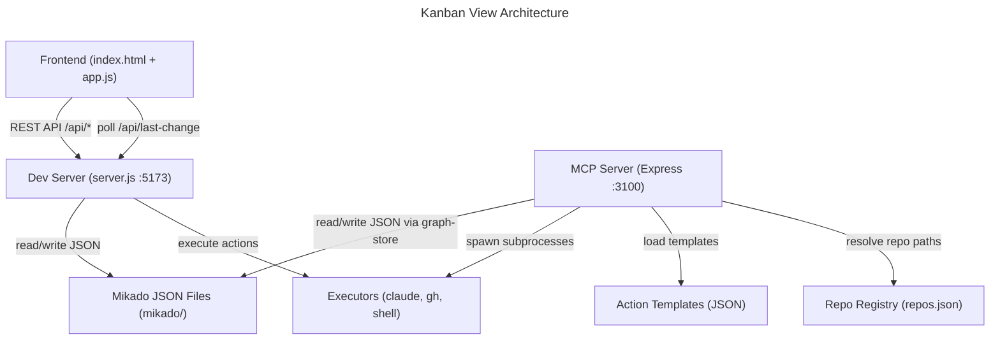

# Codebase Map

## Architecture Overview

## Tech Stack

- **Frontend**: Vanilla JS, D3, Dagre (no framework, no bundler)
- **Dev Server**: Node `http` module, no framework
- **MCP Server**: Express, MCP SDK (`StreamableHTTPServerTransport`), TypeScript, Zod
- **Data**: Mikado graph JSON files on disk

## Key Entry Points

- `index.html` + `app.js` + `styles.css` -- static frontend served by dev server
- `server.js` -- dev server, port 5173, REST API + static files + action execution
- `mcp-server/src/index.ts` -- MCP server, port 3100, Streamable HTTP transport

## Data Model (Zod schemas in `mcp-server/src/schemas.ts`)

- `Graph` -- `version`, `goal`, `created_at`, `updated_at`, `nodes` (record), `root`
- `Node` -- `id`, `description`, `status`, `depends_on[]`, `notes`, `actions[]`
- `Action` -- `id`, `type` (claude-code|gh-cli|shell|repo-template), `label`, `config`, `execution` (server|client), `status`, `result`
- `NodeStatus` -- todo, doing, in-progress, blocked, done
- `ActionStatus` -- pending, running, done, failed

## MCP Server Tools

- **Graph tools**: `list_graphs`, `get_graph`, `create_graph`, `delete_graph`
- **Node tools**: `get_node`, `add_node`, `update_node`, `delete_node`, `update_node_status`, `get_actionable_nodes`
- **Action tools**: `list_action_templates`, `execute_action`, `execute_node_actions`, `get_node_actions`, `update_action_status`
- **Repo tools**: `register_repo`, `list_repos`, `read_repo_directory`, `read_repo_file`

## Executors (`mcp-server/src/executors/`)

- `shell-executor.ts` -- runs arbitrary shell commands via `child_process`
- `claude-executor.ts` -- wraps `claude --print -p` CLI call
- `gh-executor.ts` -- wraps `gh` CLI call

## Dev Server REST API (`server.js`)

- `GET /api/graphs` -- list all graphs from `mikado/`
- `GET /api/last-change` -- timestamp for polling
- `POST /api/graphs/:name/nodes/:id/status` -- update node status
- `POST /api/graphs/:name/nodes/:id/run-actions` -- execute all node actions sequentially
- `POST /api/actions/execute` -- execute a single action

## Frontend Views (`app.js`)

- **Kanban board** -- columns by status, cards with dependency tags, status buttons, action panels
- **Graph view** -- D3 + Dagre DAG layout with zoom/pan, dependency edges
- Auto-refresh via polling `/api/last-change` every 3s

## Config (`mcp-server/src/config.ts`)

- `MCP_PORT`: 3100
- `MIKADO_DIR`: `../../mikado` (relative to src)
- `ACTION_TEMPLATES_DIR`: `../../mcp-server/action-templates`
- `REPO_REGISTRY_PATH`: `../../mcp-server/repos.json`
