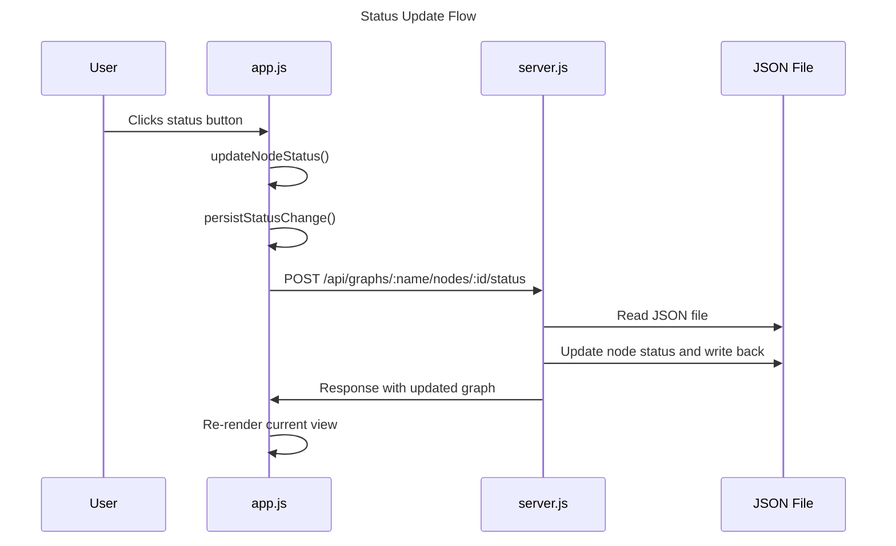
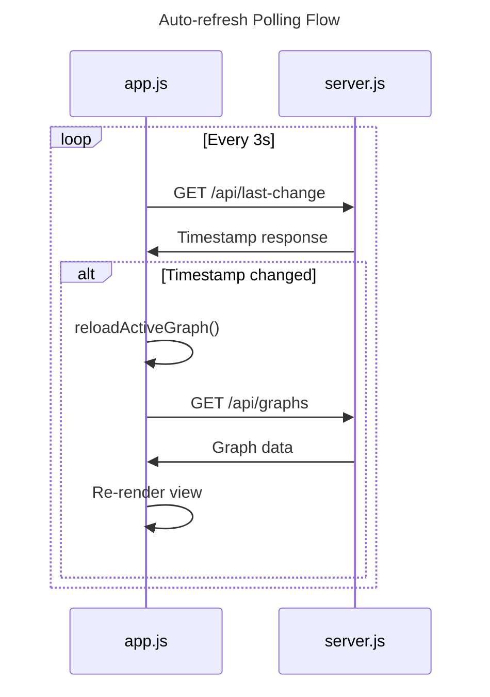

# Communication between backend and frontend

## Overview
- **Services**: fetch API (vanilla JS, no framework)
- **Request Types**: GET, POST
- **Data Flow**: Frontend fetches graph JSON from dev server, renders views, user actions POST updates, server writes JSON files, frontend re-renders
- **Error Handling**: try/catch around fetch calls, `showError()` displays errors in UI
- **Validation**: Server validates status against `statusOptions` array, validates graph name with regex

### Data Flow

### Auto-refresh Flow

