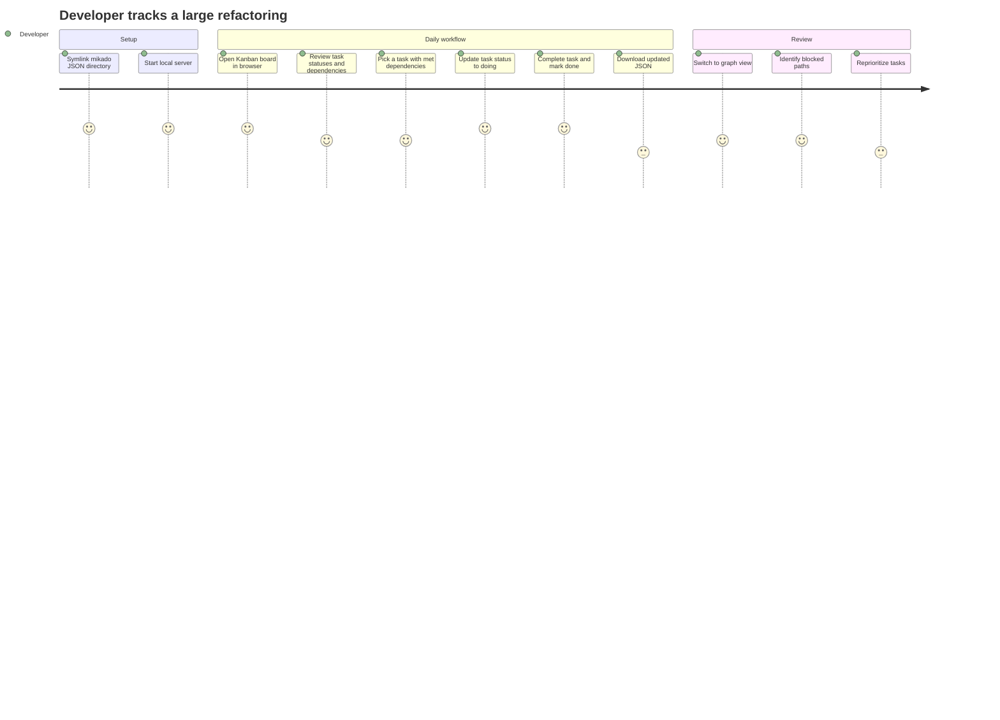
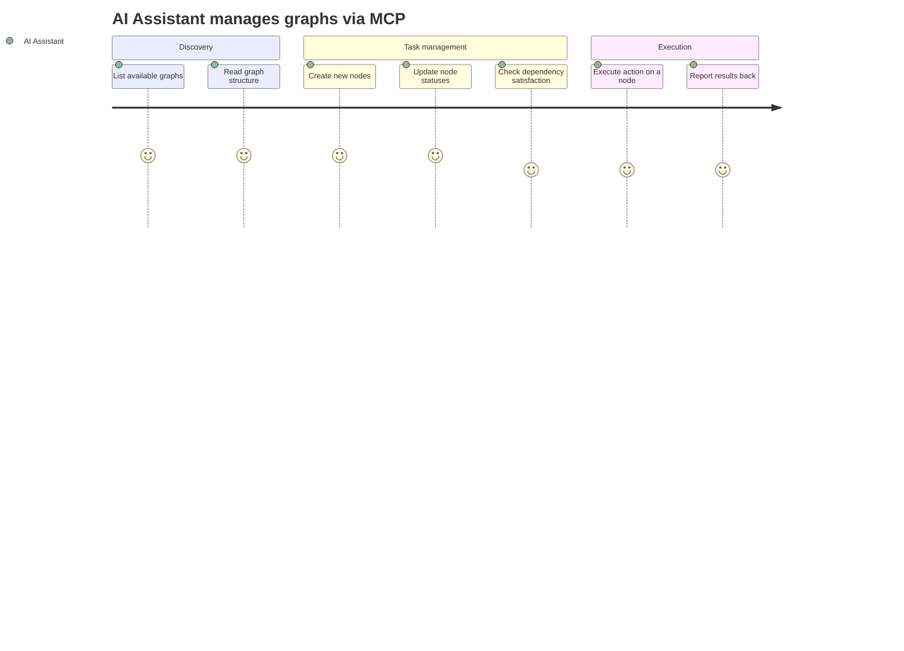

# PROJECT_BRIEF.md

## Executive Summary
- **Project Name**: Mikado Kanban View
- **Vision**: Visualize Mikado method task graphs as interactive Kanban boards with dependency tracking
- **Mission**: Provide a local-first tool to manage and visualize Mikado method decomposition graphs, enabling developers to track task progress and dependencies through both Kanban board and graph views

### Full Description
- Local-first web tool that renders Mikado JSON graphs into interactive Kanban boards
- Supports dual visualization: columnar Kanban board and D3/dagre dependency graph
- Integrates with AI assistants via MCP server for programmatic graph management
- Designed for developers performing large-scale refactorings using the Mikado method

## Context

### Core Domain
- **Mikado Method**: structured approach to making large-scale code changes by decomposing goals into dependency graphs of smaller tasks

### Ubiquitous Language
| Term | Definition | Synonyms |
|------|-----------|----------|
| Graph | A Mikado decomposition tree with a root goal and dependent nodes | Mikado Graph |
| Node | A single task/step within a graph, with status and dependencies | Task, Step |
| Root | The top-level goal node that all other nodes contribute to | - |
| Dependency | A prerequisite relationship between nodes (node B depends on node A being done) | - |
| Action | An executable operation attached to a node (`claude-code` task, `gh-cli` command, shell command) | - |
| Status | Current state of a node: `todo`, `doing`, `in-progress`, `blocked`, `done` | - |

## Features & Use-cases
- Load Mikado JSON graphs from local files or dev server via symlink
- Kanban board view with status columns (`todo`, `doing`, `in-progress`, `blocked`, `done`)
- Graph visualization using D3/dagre for dependency tree rendering
- Dependency tracking with visual highlighting of unmet dependencies (orange)
- Multi-graph support with tabs (one tab per JSON file)
- Auto-refresh on file changes (3s polling via `server.js`)
- Download updated JSON after status changes
- Action execution on nodes (`claude-code`, `gh-cli`, shell commands)
- MCP Server for AI assistant integration (graph CRUD, node management, action execution)
- Repository registry for multi-repo support

## User Journey maps (mermaid journey diagram)

### Developer

### AI Assistant

