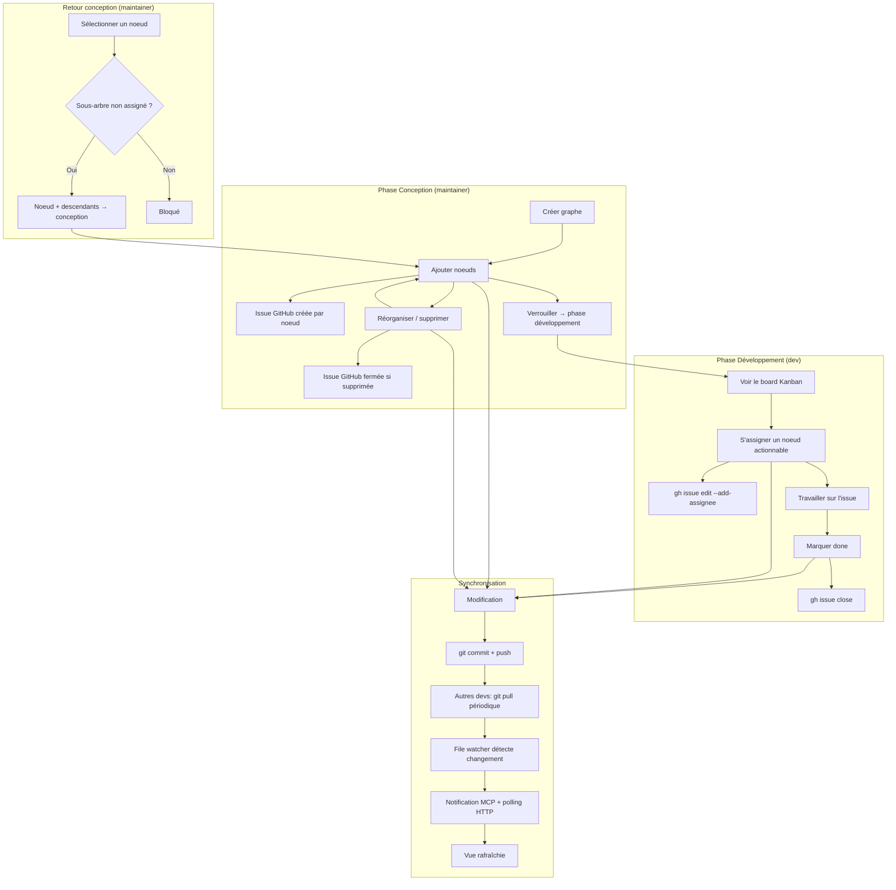

# Master Plan : Collaboration d'équipe via Git + GitHub Issues

## Contexte

Le projet kanban-view est un visualiseur Mikado/Kanban local. Les graphes sont stockés en JSON mono-fichier dans `mikado/`. Deux serveurs séparés : `server.js` (vue web, port 5173) et MCP server (outils IA, port 3100).

**Besoin** : Permettre à une équipe de collaborer sur les graphes Mikado, s'auto-assigner des tâches liées à des issues GitHub, avec Git comme transport de synchronisation.

**Décisions prises** :
- Fusionner server.js et MCP server en un seul processus
- Un fichier YAML par noeud + `_meta.yaml` par graphe
- GitHub Issues lié à chaque noeud
- Deux phases : Conception (maintainers) / Développement (devs)
- Synchronisation via git pull périodique + file watcher + notifications MCP
- GitHub uniquement pour la v1

**Modèle de déploiement** : Chaque dev fait tourner sa propre instance du serveur sur sa machine, à partir de son propre clone du repo. Le serveur utilise `gh` CLI authentifié localement — chaque dev est donc identifié par son propre compte GitHub. Il n'y a pas de serveur centralisé partagé.

---

## User Journey



---

## Architecture cible

```
[Repo externe: meal-planner]
  Claude Code ──── MCP (HTTP) ──────────►  Serveur unifié (port 3100)
                                             ├── MCP tools (graph, node, repo)
  Navigateur ◄──── HTTP ──────────────────   ├── Vue Kanban (fichiers statiques)
                                             ├── API REST (/api/*)
                                             ├── Git sync (pull/push)
                                             ├── gh CLI (issues)
                                             ├── File watcher (chokidar)
                                             └── Lit/écrit mikado/{graph}/*.yaml
```

---

## Phases

| Phase | Nom | Dépend de |
|-------|-----|-----------|
| 0 | Configuration & fusion serveurs | - |
| 1 | Migration YAML multi-fichiers | 0 |
| 2 | Git comme transport | 1 |
| 3 | Intégration GitHub Issues | 2 |
| 4 | Phases Conception / Développement | 2 |
| 5 | Vue web : assignation & identité | 3, 4 |

---

## Phase 0 — Configuration & fusion serveurs

**Objectif** : Un seul processus Express servant la vue web + l'API REST + le MCP.

### Tâches

- [ ] Installer dépendances : `js-yaml`, `chokidar`
- [ ] Migrer les endpoints de `server.js` (CommonJS) vers le MCP server (TypeScript ESM)
  - `/api/graphs` → réutilise `listGraphs` de graph-store
  - `/api/graphs/:name/nodes/:id/status` → réutilise `updateNode` de node-operations
  - `/api/last-change` → timestamp de dernière modification
  - Fichiers statiques (index.html, app.js, styles.css)
- [ ] Servir les fichiers statiques via Express dans `index.ts`
- [ ] Supprimer `server.js` devenu obsolète
- [ ] Adapter `app.js` si les URLs changent (normalement non — mêmes endpoints)
- [ ] Mettre à jour les tests E2E (port unique, un seul processus)
- [ ] Vérifier : `pnpm run build` OK, tests unitaires OK, tests E2E OK

### Critères de validation
- Un seul `node dist/index.js` démarre tout
- Vue web accessible sur le même port que le MCP
- Tous les tests passent

---

## Phase 1 — Migration YAML multi-fichiers

**Objectif** : Chaque graphe est un dossier, chaque noeud un fichier YAML.

### Structure cible

```
mikado/
  meal-planner-firebase/
    _meta.yaml              # goal, root, version, phase, created_at, updated_at
    setup-firestore.yaml    # id, description, status, depends_on, notes, issue_number?
    create-data-models.yaml
    migrate-recipes.yaml
```

### Format `_meta.yaml`

```yaml
version: "1.0"
goal: "Migrate meal-planner to Firebase"
root: "migrate-firebase"
phase: "design"
github:
  owner: "my-org"
  repo: "meal-planner"
created_at: "2026-03-19T10:00:00Z"
updated_at: "2026-03-19T10:00:00Z"
```

### Format `{node-id}.yaml`

Le `id` du noeud est dérivé du nom de fichier (sans extension). Pas de champ `id` dans le YAML — le nom de fichier fait foi.

```yaml
description: "Set up Firestore SDK and configuration"
status: "todo"
depends_on:
  - "migrate-firebase"
notes: ""
issue_number: null
assignee: null
created_at: "2026-03-19T10:00:00Z"
updated_at: "2026-03-19T10:00:00Z"
```

### Tâches

- [ ] Réécrire `graph-store.ts` : lire un dossier de YAML → reconstruire l'objet Graph
- [ ] Réécrire `writeGraph` : écrire `_meta.yaml` + un fichier par noeud
- [ ] Ajouter `addNodeFile`, `updateNodeFile`, `deleteNodeFile` pour opérations granulaires
- [ ] Adapter `schemas.ts` : ajouter `phase` et `github` (owner/repo) à Graph, `issue_number` et `assignee` à Node
- [ ] Le `id` du noeud est dérivé du nom de fichier (pas de champ `id` dans le YAML)
- [ ] Script de migration : convertir les JSON existants en dossiers YAML
- [ ] Adapter les tests unitaires (graph-store, node-operations, schemas)
- [ ] Adapter les tests E2E (fixtures en YAML)
- [ ] Rétrocompatibilité : supporter la lecture des anciens JSON en fallback (optionnel)

### Critères de validation
- `readGraph` reconstruit un Graph complet depuis un dossier YAML
- `writeGraph` écrit un dossier de fichiers YAML
- Tous les tests passent
- La vue web Kanban affiche les graphes YAML comme avant

---

## Phase 2 — Git comme transport

**Objectif** : Chaque modification est persistée via git commit + push. Les changements des autres sont récupérés via git pull périodique.

### Tâches

- [ ] Créer `mcp-server/src/git/git-sync.ts` :
  - `gitPull(repoPath)` — exécute `git pull` via child_process
  - `gitCommitAndPush(repoPath, files, message)` — `git add <fichiers spécifiques> && git commit -m "..." && git push`
  - `isGitRepo(repoPath)` — vérifie que le dossier est un repo git
  - Mutex interne : les opérations git sont sérialisées (une à la fois) pour éviter les race conditions
  - Retry sur push rejected : `git pull --rebase && git push` (max 3 tentatives)
- [ ] Intégrer git-sync dans les opérations d'écriture (après writeGraph, addNode, updateNode, deleteNode) — passer les fichiers spécifiques modifiés, pas tout `mikado/`
- [ ] Ajouter un git pull périodique (configurable, défaut 30s)
- [ ] Ajouter file watcher (chokidar) sur le dossier mikado/ avec **distinction source du changement** :
  - Flag `localWrite` activé pendant les écritures locales → le watcher ignore ces événements
  - Seuls les changements externes (git pull) déclenchent les notifications
- [ ] Déclarer capabilities MCP : `resources: { subscribe: true, listChanged: true }`
- [ ] Émettre `notifications/resources/list_changed` quand un graphe apparaît/disparaît
- [ ] Émettre `notifications/resources/updated` quand un graphe change
- [ ] Le polling HTTP `/api/last-change` continue de fonctionner pour la vue web
- [ ] Tests : git-sync (avec repo temporaire), file watcher

### Critères de validation
- Une modification via MCP tool → commit + push automatique
- Git pull récupère les changements → file watcher détecte → notification MCP émise
- La vue web se rafraîchit après un changement externe (via polling HTTP existant)

---

## Phase 3 — Intégration GitHub Issues

**Objectif** : Chaque noeud est lié à une issue GitHub. Créer/fermer des issues via `gh` CLI.

### Tâches

- [ ] Créer `mcp-server/src/gh/gh-client.ts` :
  - `createIssue(owner, repo, title, body?)` → retourne le numéro d'issue
  - `closeIssue(owner, repo, issueNumber)`
  - `assignIssue(owner, repo, issueNumber, username)`
  - `unassignIssue(owner, repo, issueNumber, username)`
  - `getCurrentUser()` → username GitHub du dev local
  - `getUserPermission(owner, repo, username)` → "admin" | "maintain" | "write" | "read"
  - `isGhAvailable()` → vérifie que `gh` est installé et authentifié
- [ ] Stocker `issue_number` dans le YAML du noeud après création
- [ ] Appeler `createIssue` à la création d'un noeud (en phase conception)
- [ ] Appeler `closeIssue` à la suppression d'un noeud
- [ ] Appeler `closeIssue` quand un noeud passe à "done" (dans la couche data, pas dans la vue web — une seule implémentation)
- [ ] Appeler `assignIssue` / `unassignIssue` quand le champ `assignee` change (dans la couche data)
- [ ] Ajouter un label automatique (ex: `mikado` ou nom du graphe)
- [ ] MCP tool : `get_current_user` — retourne le username GitHub
- [ ] Tests : gh-client (mock child_process)

### Critères de validation
- Créer un noeud → issue GitHub créée, numéro stocké dans le YAML
- Supprimer un noeud → issue GitHub fermée
- `gh` absent → erreur claire, pas de crash

---

## Phase 4 — Phases Conception / Développement

**Objectif** : Verrou sur le graphe. Maintainers conçoivent, devs développent.

### Tâches

- [ ] Créer `mcp-server/src/data/phase-operations.ts` (fonctions pures) :
  - `lockGraph(graph)` → passe `phase` de "design" à "development" (si GitHub Issues est configuré, vérifie que tous les noeuds ont une issue — sinon, pas de contrainte)
  - `unlockSubtree(graph, nodeId)` → noeud + descendants repassent en conception si aucun assigné
  - `getDescendants(graph, nodeId)` → retourne tous les noeuds qui dépendent (récursivement)
  - `canUnlockSubtree(graph, nodeId)` → vérifie qu'aucun noeud du sous-arbre n'est assigné
- [ ] Gardes dans les MCP tools existants :
  - `add_node` / `delete_node` → bloqué si phase = "development"
  - Vérification maintainer avant modification structurelle
- [ ] MCP tools : `lock_graph`, `unlock_subtree`
- [ ] Tests : phase-operations (fonctions pures, même pattern que node-operations)

### Critères de validation
- En phase développement, `add_node` retourne une erreur
- Un dev non-maintainer ne peut pas verrouiller/déverrouiller
- `unlock_subtree` sur un noeud assigné → erreur

---

## Phase 5 — Vue web : assignation & identité

**Objectif** : Les devs s'auto-assignent depuis la vue Kanban.

### Tâches

- [ ] Endpoint REST `GET /api/me` → retourne le username GitHub (cache au démarrage)
- [ ] Endpoint REST `POST /api/graphs/:name/nodes/:id/assign` → met à jour le champ `assignee` dans le YAML (la couche data de phase 3 se charge du `gh issue edit`)
- [ ] Endpoint REST `POST /api/graphs/:name/nodes/:id/unassign` → idem, la couche data gère `gh`
- [ ] Adapter `app.js` :
  - Au chargement, fetch `/api/me` pour connaître l'utilisateur courant
  - Sur chaque carte : afficher l'assigné (nom ou avatar)
  - Bouton "Prendre" visible uniquement sur les noeuds actionnables + non-assignés + phase development
  - Bouton "Libérer" visible si assigné à soi
  - Distinction visuelle : noeud non-assigné (gris), assigné à moi (accent), assigné à un autre (nom affiché)
  - Indicateur de phase (conception/développement) dans le header du graphe
- [ ] Adapter `styles.css` : styles pour assignation, indicateurs de phase
- [ ] Tests E2E : scénarios d'assignation

### Critères de validation
- Clic "Prendre" → issue GitHub assignée, carte mise à jour, commit + push
- Clic "Done" → issue fermée, statut mis à jour, commit + push
- Noeud assigné à un autre → bouton grisé, nom affiché

---

## Risques identifiés

| Risque | Impact | Mitigation |
|--------|--------|------------|
| `gh` CLI absente sur la machine d'un dev | Bloquant pour phases 3-5 | Vérification au démarrage, message d'erreur clair |
| Conflits git sur les fichiers YAML | Modéré | Un fichier par noeud minimise les conflits |
| Notifications MCP : accès au Server brut nécessaire | Faible | Documenté, contournement via `server.server` |
| Sessions MCP multiples + file watcher partagé | Modéré | File watcher global, notifications broadcast à toutes les sessions |
| Latence git pull (30s par défaut) | UX | Configurable, possibilité de réduire |
| Push rejected (concurrent push) | Modéré | Retry avec `git pull --rebase` (max 3 tentatives) |
| Boucle file watcher ↔ git push | Bloquant | Flag `localWrite` pour ignorer les changements locaux dans le watcher |
| Race condition opérations git | Modéré | Mutex interne sérialisant les opérations git |

---

## Estimation

| Phase | Complexité |
|-------|------------|
| 0 — Config & fusion | Moyenne |
| 1 — Migration YAML | Haute |
| 2 — Git transport | Moyenne |
| 3 — GitHub Issues | Moyenne |
| 4 — Phases conception/dev | Faible |
| 5 — Vue web assignation | Moyenne |

---

## Confidence : 9/10

### ✅ Raisons
- Architecture claire (un seul processus)
- Chaque phase est indépendante et testable
- Les fonctions pures (node-operations, phase-operations) permettent des tests solides
- Git + YAML multi-fichiers élimine les conflits de merge
- MCP SDK supporte nativement les notifications

### ❌ Risques résiduels
- Performance du git pull périodique sur de gros repos (mitigé par le fait que seul mikado/ est surveillé)
- Le `git pull --rebase` en retry peut échouer sur un vrai conflit de contenu (même fichier modifié des deux côtés) — rare grâce au un-fichier-par-noeud mais possible sur `_meta.yaml`
